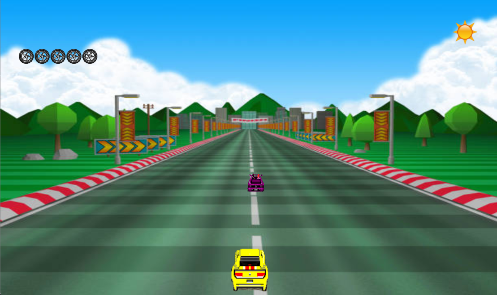
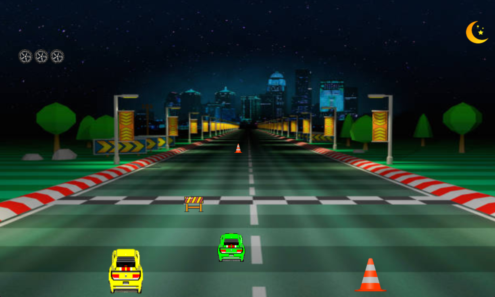
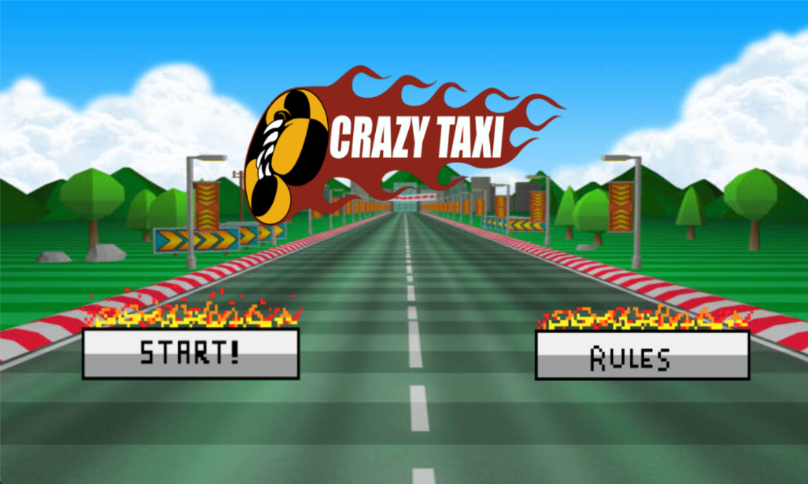
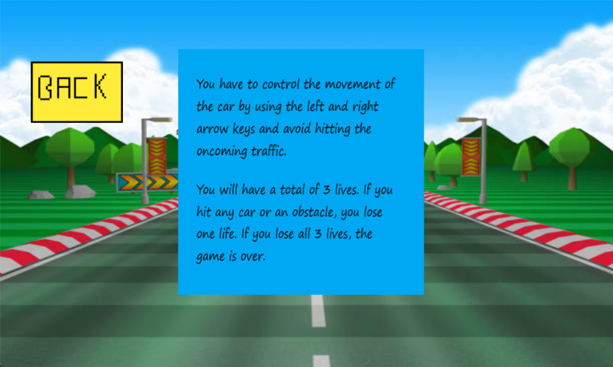

# Crazy Taxi

## Description
This is a game inspired by the classic Crazy Taxi game. The goal is to drive for as long as possible without crashing into other cars. This game was developed as a project for the CS 224 Object Oriented Programming course at Habib University.

## Features
- Day and night mode
- Background music and sound effects
- Scoreboard
- Menu and rules screen

## Rules
- The player starts with 5 lives
- The player can move left and right using the arrow keys
- The player can horn using the *F* key
- The player is awarded 5 points for every vehicle/obstacle passed

## Dependencies
- C++ compiler
- SDL2
- SDL2_image
- SDL2_mixer
- SDL2_ttf

## How to play
Clone the repository

```bash
cd 'Crazy Taxi'
```

Compile and run the game

```bash
g++ *.cpp -IC:\mingw_dev_lib\include\SDL2 -LC:\mingw_dev_lib\lib -w -lmingw32 -lSDL2main -lSDL2 -lSDL2_image -lSDL2_mixer -lSDL2_ttf -o a.exe

a.exe
```

## Screenshots

**Left:** Day mode

**Right:** Night mode
<div style="display: flex;">
    
    <hr style="border: none; border-top: 1px solid #ccc; margin: 1%;">
    
</div>

**Left:** Menu screen

**Right:** Rules screen

<div style="display: flex;">
    
    <hr style="border: none; border-top: 1px solid #ccc; margin: 1%;">
    
</div>

## Credits
- [Pngitem](https://www.pngitem.com/) for the sprites.
- [OpenGameArt](https://opengameart.org/) for the background music and sound effects.

## Authors
- [Ali Asghar Chakera](https://github.com/aliasgharchakera)
- [Shahid Mahmood](https://github.com/MShahidMahmood)
- Omema Rizvi